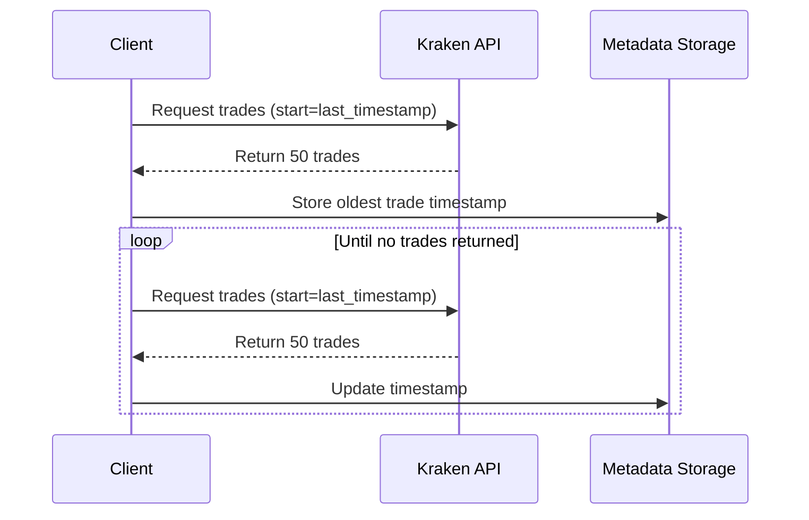

# Kraken API History Limit

## **Problem Statement**

Kraken's REST API enforces a **history limit** on trade and staking reward retrieval, allowing only **50 records per request**. This limitation means that any attempt to fetch trade history or staking rewards will return only a partial dataset, requiring multiple requests to retrieve the full history.

Without an appropriate pagination strategy, our system will:

- **Miss older trades or staking rewards** beyond the most recent 50 entries.
- **Inconsistently store data across MongoDB and local file storage (JSON/CSV).**
- **Fail to resume efficiently**, causing redundant data retrieval or data loss.

## **Solution: Implementing Paginated Retrieval**

To overcome this limitation, we will implement **pagination on retrieval**, ensuring that:

1. **All trades and staking rewards are retrieved completely**.
2. **Both MongoDB and file storage receive the same complete dataset**.
3. **Retrieval resumes from where it last left off**, preventing duplication or missed data.

### **Pagination Strategy**

We will utilize the Kraken API’s **`start` parameter**, which allows fetching records after a specific timestamp.

**Steps:**

1. Retrieve the first batch of trades/staking rewards.
2. Identify the **oldest timestamp** in the response.
3. Store this timestamp in metadata (`kraken_metadata`).
4. Use this timestamp as the **new `start` parameter** for the next request.
5. Repeat until no more data is returned.

### **Pseudocode for Paginated Retrieval**

```python
start_time = get_last_retrieval_timestamp("trades")
all_trades = []
while True:
    response = get_trade_history(start=start_time)
    if not response:
        break  # Stop when no more trades are returned
    
    all_trades.extend(response)
    start_time = min(trade["time"] for trade in response)  # Update `start` for next batch
    store_metadata("trades", start_time)
```

### **Mermaid Diagram: Pagination Flow**



## **Impact on Metadata Tracking**

- **Prevents data loss:** Ensures we **never re-fetch already stored trades**.
- **Improves resumption:** If the script stops, it will **resume from the last successful retrieval point**.
- **Consistency:** MongoDB and local storage will always have **identical datasets**.

## **References**

- Kraken API Documentation: [Get Trade History](https://docs.kraken.com/api/docs/rest-api/get-trade-history/)
