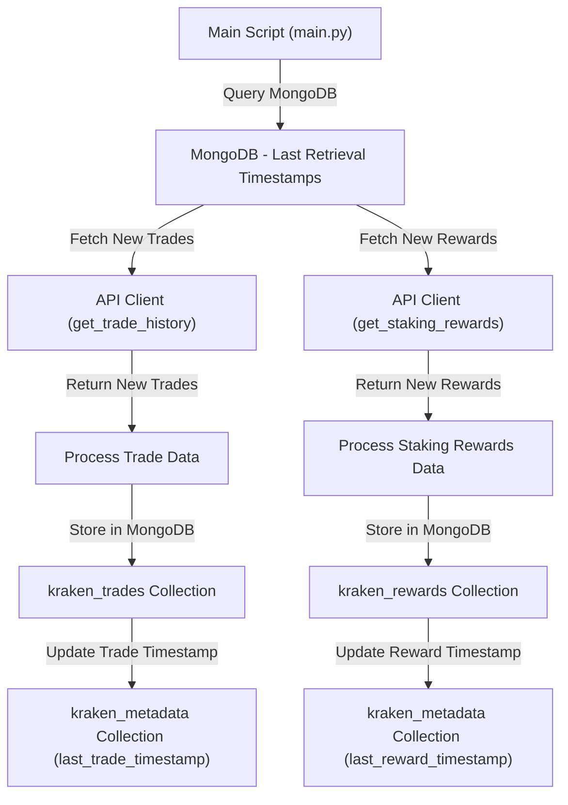
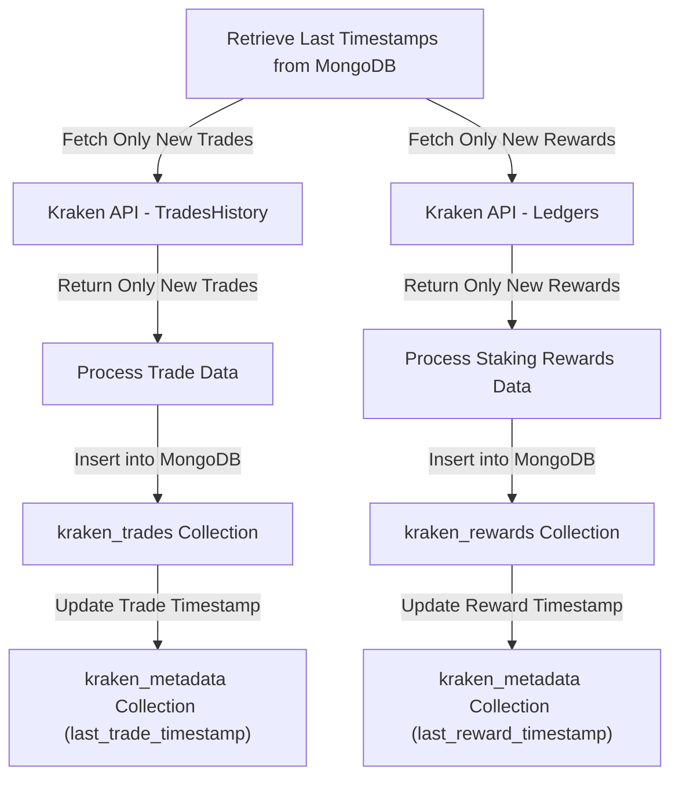

# MongoDB Integration for Kraken Trade & Staking Rewards

[TOC]

## 📌 Overview

This document outlines the design and implementation strategy for integrating **MongoDB** into the Kraken Trade & Staking Rewards retrieval application. The integration will allow structured storage of trade history and staking rewards while enabling **incremental data retrieval** based on the last stored timestamps.

## 🎯 Goals

- **Store structured trade & staking rewards data** in MongoDB.
- **Retrieve only new data** since the last recorded timestamps.
- **Ensure data integrity** by avoiding duplicate entries.
- **Future-proof the schema** for potential expansion.

## 🏗️ Architecture Overview

This integration introduces MongoDB as the **primary storage backend** for trade and staking reward data. The following flow illustrates how data retrieval and storage will work:

## 🗃️ MongoDB Schema & Collections

To support structured storage and efficient querying, three MongoDB collections will be used:

### **1️⃣ `kraken_trades` (Stores Trade History)**

| Field | Type | Description |
|--------|--------|-------------|
| `_id` | `ObjectId` | Unique MongoDB identifier |
| `txid` | `String` | Unique trade transaction ID |
| `pair` | `String` | Trading pair (e.g., BTC/USD) |
| `time` | `Timestamp` | Time of trade execution |
| `type` | `String` | `buy` or `sell` |
| `ordertype` | `String` | Market/limit order type |
| `price` | `Decimal` | Trade price |
| `cost` | `Decimal` | Trade cost |
| `fee` | `Decimal` | Trade fee |
| `vol` | `Decimal` | Trade volume |

### **2️⃣ `kraken_rewards` (Stores Staking Rewards)**

| Field | Type | Description |
|--------|--------|-------------|
| `_id` | `ObjectId` | Unique MongoDB identifier |
| `ledger_id` | `String` | Unique ledger entry ID |
| `refid` | `String` | Reference transaction ID |
| `time` | `Timestamp` | Time of reward issuance |
| `asset` | `String` | Staked asset (e.g., ETH2.S) |
| `amount` | `Decimal` | Staking reward amount |
| `balance` | `Decimal` | Post-reward balance |

### **3️⃣ `kraken_metadata` (Stores Last Retrieval Timestamps)**

| Field | Type | Description |
|--------|--------|-------------|
| `_id` | `ObjectId` | Unique MongoDB identifier |
| `last_trade_timestamp` | `Timestamp` | Last trade history retrieval time |
| `last_reward_timestamp` | `Timestamp` | Last staking reward retrieval time |

## 🔄 Incremental Data Retrieval Strategy

Instead of fetching all available data every time, we will use **incremental data retrieval** based on the last stored timestamps.

### **Retrieval Process:**

1️⃣ **Query MongoDB (`kraken_metadata`)** to get the last recorded timestamps for **trades** and **rewards**.
2️⃣ **Modify API requests** to fetch only data **after these timestamps**.
3️⃣ **Insert only new records** into `kraken_trades` and `kraken_rewards`.
4️⃣ **Update the last retrieval timestamp** in `kraken_metadata`.

## 🛠️ Design Decisions

### **1️⃣ Store Structured Data Only**

- **Decision:** MongoDB will only store **structured trade and reward data** (no raw API responses).
- **Reason:** Ensures efficient queries, storage optimization, and easier data processing.

### **2️⃣ Use Separate Timestamps for Trades & Rewards**

- **Decision:** Each retrieval function (`get_trade_history()` and `get_staking_rewards()`) will track its own timestamp.
- **Reason:** Ensures that **one API failure does not block the other retrieval process**, preventing data loss.

### **3️⃣ No Manual Timestamp Overrides**

- **Decision:** The **last retrieval timestamps** will always come from MongoDB.
- **Reason:** Prevents accidental overwrites and ensures consistent data tracking.

### **4️⃣ Exit on Errors During Development**

- **Decision:** The script will **exit on API failures** (instead of retrying) for now.
- **Reason:** Simplifies debugging; retry logic can be added later.

### **5️⃣ Future-Proofing the Database**

- **Decision:** Design MongoDB schema with **expandability in mind**.
- **Reason:** Allows easy **integration of additional Kraken API endpoints** in future iterations.

## 🚀 Next Steps

1️⃣ **Implement MongoDB connection & schema setup**.  
2️⃣ **Modify `api_client.py`** to fetch only new data based on the last timestamps.  
3️⃣ **Modify `data_handler.py`** to store data in MongoDB instead of JSON/CSV.  
4️⃣ **Ensure logging tracks MongoDB transactions** and data retrieval.  

---
This document follows the **Google Markdown Style Guide**.
