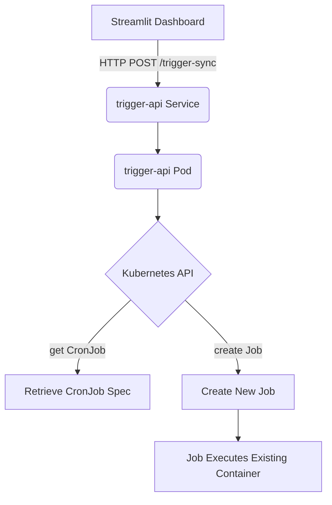
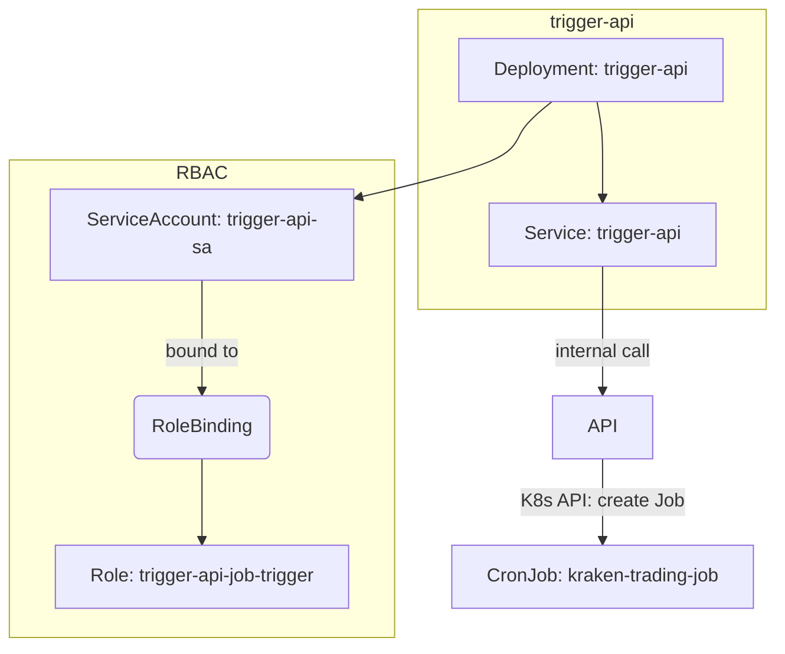

## **Problem Statement**

The Kraken trading sync process is currently triggered via a scheduled `CronJob`, which runs a containerized job every 6 hours. However, we now want to allow users to manually trigger this sync from within the Streamlit dashboard, **without duplicating or diverging** from the job logic defined in the CronJob. Additionally, the sync trigger should remain internal to the Kubernetes cluster, avoiding any external exposure.

---

## **Design Summary**

To fulfill this requirement, we will:

1. Create an always-running API (`trigger-api`) within the same namespace.
2. Expose a `/trigger-sync` endpoint internally via a `ClusterIP` service.
3. Grant the API permission to spawn a `Job` using the existing `CronJob` definition.
4. Use the same image/command defined in the `CronJob`, preserving behavior consistency.

---

## **Mermaid Diagram: Trigger Flow**

---

## **Kubernetes Resources Required**

| Resource Kind         | Name                            | Purpose                                                                 |
|-----------------------|----------------------------------|-------------------------------------------------------------------------|
| **Deployment**        | `trigger-api`                    | Always-running internal service to expose the `/trigger-sync` endpoint |
| **Service**           | `trigger-api`                    | Internal ClusterIP service for the Streamlit dashboard to call         |
| **Role**              | `trigger-api-job-trigger`        | Grants permissions to create Jobs from CronJobs                        |
| **RoleBinding**       | `trigger-api-job-trigger-binding`| Binds the above Role to the `trigger-api` ServiceAccount               |
| **ServiceAccount**    | `trigger-api-sa`                 | Used by the API Deployment for RBAC                                    |
| *(Optional)* ConfigMap| `trigger-api-config`             | Centralized config (e.g., CronJob name, namespace)                     |

---

## **Mermaid Diagram: Kubernetes Resource Relationships**

---

## **Trigger Behavior Expectations**

- The Job spawned by the trigger will be identical to the CronJob (same container/image, env, volume mounts, etc.).
- No changes will be made to the CronJob itself.
- Monitoring and result feedback (success/failure) may be added later via:
  - Job status polling
  - Event watching
  - Logging streams (future enhancement)

---

## **Benefits of This Design**

- ✅ **No code duplication**: Manual and scheduled sync use same logic.
- ✅ **Cluster-local**: No public ingress or external URL required.
- ✅ **RBAC-controlled**: Secure and scoped execution permissions.
- ✅ **Streamlit-integrated**: Simple, user-initiated sync from UI.

---

## **Next Steps**

1. Generate all manifests:
   - Deployment, Service, Role, RoleBinding, ServiceAccount
2. Implement the `/trigger-sync` endpoint logic (Python Flask or FastAPI).
3. Replace Streamlit trigger URL input with internal DNS or ConfigMap value.
4. Add success/failure feedback in Streamlit after calling the API.

