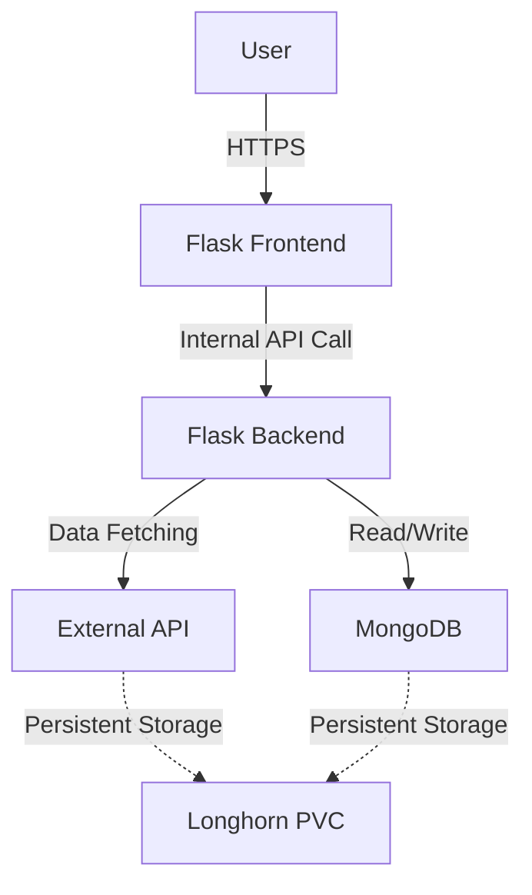
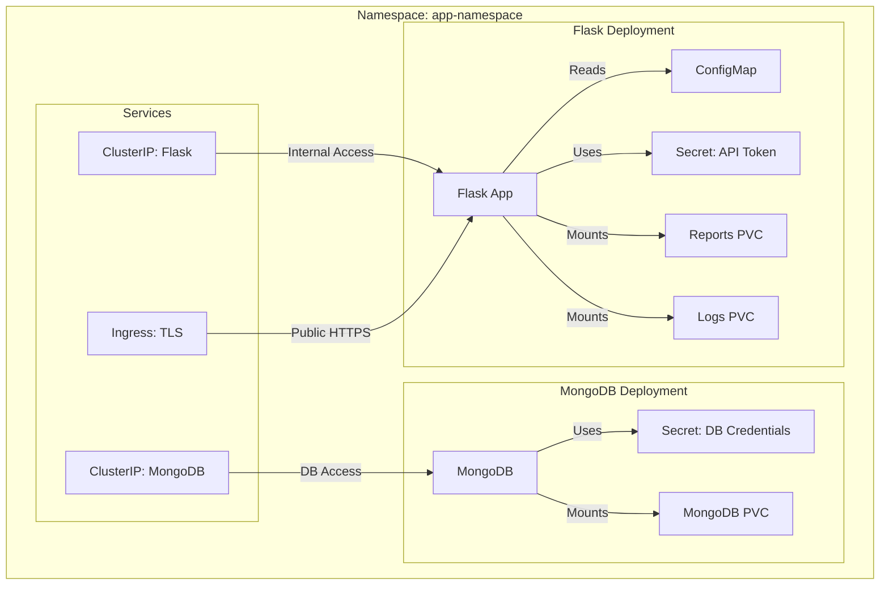
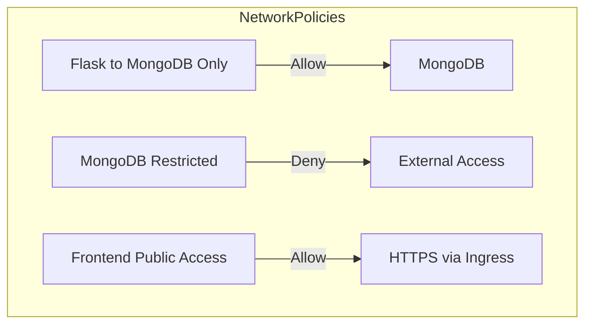

# Infrastructure Design Document

## Table of Contents

[TOC]

---

## Introduction

This document outlines the infrastructure design for the deployment of a Python Flask-based application with a MongoDB database in a Kubernetes cluster. The application consists of:

- A web frontend and backend running within the same container (Flask).
- A Python service that fetches data from an external API.
- A MongoDB database for persistent storage.
- A storage solution using Longhorn for report storage and logging.

This document follows best practices in security, observability, and scalability.

---

## Application Components

### **1. Web Frontend & Backend (Python Flask)**

- Runs in a single container.
- Fetches data from an internal web-based API.
- Serves the user interface and provides an interface to trigger applications.
- Exposes an HTTP endpoint via Kubernetes Ingress with TLS.
- Stores generated reports in a persistent volume (Longhorn, 1GB, 7-day retention).
- Stores logs in a persistent volume.

### **2. MongoDB Database**

- Runs as a managed service inside Kubernetes.
- Stores application data.
- Uses a PersistentVolume (Longhorn) for data storage.
- Only accessible within the cluster.

---

## Kubernetes Resource Overview

### **1. Namespaces**

- `app-namespace`: Isolated namespace for all application resources.

### **2. Persistent Storage**

- **PersistentVolumeClaims (PVCs)**:
  - Reports Storage: 1GB (Longhorn, 7-day retention).
  - Logs Storage: PersistentVolume (size TBD).
  - MongoDB Data: PersistentVolume (size TBD).

### **3. Secrets & Configuration**

- **Secrets**:
  - MongoDB credentials.
  - External API token.
- **ConfigMaps**:
  - Application settings.

### **4. Deployments**

- **Flask Application (Frontend & Backend)**
  - Runs as a single container.
  - Uses ClusterIP service for internal communication.
  - Mounts logs and reports storage.
- **MongoDB**
  - Runs as a StatefulSet for persistent storage.
  - Uses ClusterIP for internal access.

### **5. Services**

- **ClusterIP for Flask App**: Internal communication.
- **ClusterIP for MongoDB**: Internal database access.
- **LoadBalancer or Ingress**: Public HTTPS access for Flask frontend.

---

## Security Considerations

- **Run as Non-Root Users**
- **ServiceAccount with Minimal Permissions**
- **NetworkPolicies**
  - Flask can talk to MongoDB only.
  - MongoDB is restricted from external access.
- **Secrets Management**
  - Use Kubernetes Secrets for MongoDB credentials and API tokens.
- **Ingress with TLS**
  - HTTPS enforced using Let's Encrypt or a private certificate.

---

## Reliability & Observability

- **Liveness & Readiness Probes**
  - Flask app: Ensures it’s running and dependencies are loaded.
  - MongoDB: Ensures database is active.
- **Monitoring & Logging**
  - Prometheus & Grafana for monitoring.
  - FluentBit or Loki for log aggregation.
- **Storage & Backup**
  - Longhorn snapshots (optional future backups).

---

## Deployment & CI/CD

- **GitOps (ArgoCD) or CI/CD pipeline** for automatic deployments.
- **Helm or Kustomize** for environment-specific configurations.
- **CPU & Memory Requests/Limits** to prevent resource starvation.

---

## Diagrams

### **1. High-Level Architecture**

### **2. Kubernetes Deployment Structure**

### **3. Security and NetworkPolicies**

---
