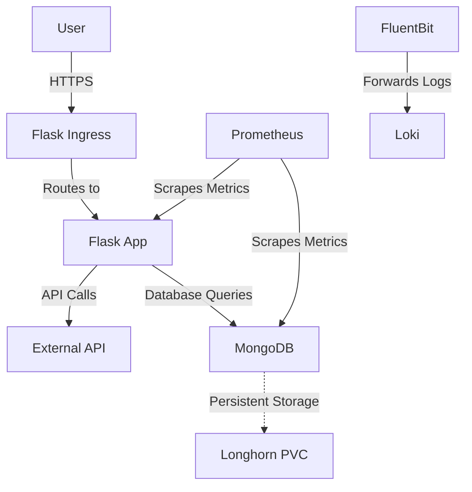

# Kubernetes Application Deployment

## Table of Contents

- [Kubernetes Application Deployment](#kubernetes-application-deployment)
  - [Table of Contents](#table-of-contents)
  - [Overview](#overview)
  - [Architecture](#architecture)
  - [Components](#components)
    - [**Secrets \& ConfigMaps**](#secrets--configmaps)
    - [**Deployments \& Services**](#deployments--services)
    - [**Ingress**](#ingress)
    - [**Network Policies**](#network-policies)
    - [**Monitoring \& Logging**](#monitoring--logging)
    - [**Health Probes**](#health-probes)
    - [**Persistent Storage**](#persistent-storage)
    - [**RBAC**](#rbac)
  - [Deployment Instructions](#deployment-instructions)
    - [**Prerequisites**](#prerequisites)

## Overview

This repository contains Kubernetes manifests for deploying a **Flask-based web application** with a **MongoDB database** on a **bare-metal Kubernetes cluster**. The architecture follows best practices in **security, scalability, and observability**.

## Architecture

## Components

### **Secrets & ConfigMaps**

- **`app-secrets`**: Stores credentials for MongoDB and external API.
- **`app-config`**: Defines environment variables such as `MONGO_URI`, `LOG_LEVEL`, and storage paths.

### **Deployments & Services**

- **Flask Deployment (`flask-app`)**
  - Runs the frontend and backend as a single application.
  - Uses **environment variables** from `app-config` and `app-secrets`.
  - Includes **resource limits and requests**.
  - Mounts storage volumes for reports and logs.
- **MongoDB StatefulSet (`mongodb`)**
  - Uses **persistent storage** for database data.
  - Includes **health probes** for stability.
- **Services**
  - `flask-service` (ClusterIP, exposes Flask on **port 5000**).
  - `mongodb-service` (ClusterIP, exposes MongoDB on **port 27017**).

### **Ingress**

- **`flask-ingress`**
  - Uses **NGINX Ingress Controller**.
  - Enforces **HTTPS** using **Let’s Encrypt**.
  - Routes `myapp.example.com` to `flask-service` on **port 5000**.

### **Network Policies**

- **`allow-flask-to-mongodb`**: Only Flask can communicate with MongoDB.
- **`restrict-mongodb-external-access`**: Blocks all external access to MongoDB.
- **`allow-ingress-flask`**: Allows public access to Flask over **port 5000**.

### **Monitoring & Logging**

- **ServiceMonitors for Prometheus**
  - `flask-servicemonitor`: Scrapes Flask metrics from `/metrics`.
  - `mongodb-servicemonitor`: Scrapes MongoDB metrics from `/metrics`.
- **FluentBit Logging**
  - Reads logs from **`/mnt/logs/*.log`**.
  - Forwards logs to **Loki** for centralized logging.

### **Health Probes**

- **Flask App**
  - **Liveness probe**: `/healthz`
  - **Readiness probe**: `/ready`
- **MongoDB**
  - Uses **`mongosh`** to run `db.adminCommand('ping')`.

### **Persistent Storage**

- **Longhorn-backed Persistent Volume Claims (PVCs)**
  - `reports-pvc` (1GB) for short-term report storage.
  - `logs-pvc` (1GB) for application logs.
  - `mongodb-pvc` (5GB) for MongoDB data.

### **RBAC**

- **Namespace: `app-namespace`**
- **ServiceAccount: `app-service-account`**
- **Role & RoleBinding**
  - Grants read-only access to resources like Pods, ConfigMaps, Secrets, PVCs, Deployments, and Network Policies.

## Deployment Instructions

### **Prerequisites**

- Kubernetes cluster with **kubeadm** and **MetalLB**.
- **Longhorn** installed for persistent storage.
- **NGINX Ingress Controller** installed.
- **Prometheus Operator & FluentBit** deployed.

