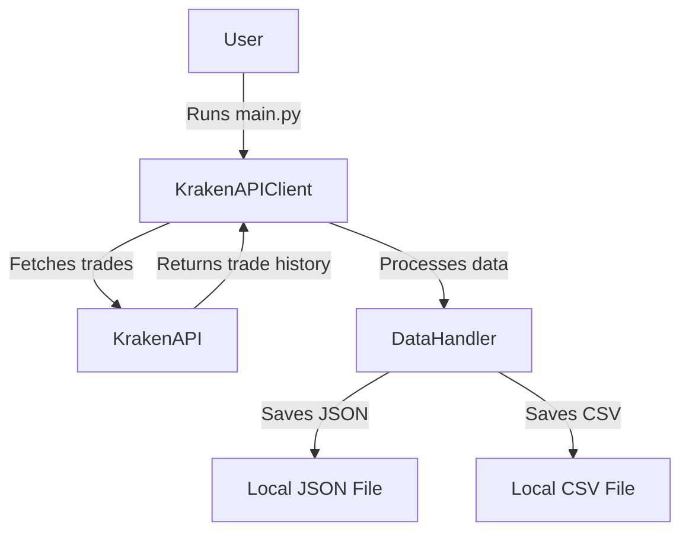

# Kraken Trade History Retrieval

## Table of Contents

- [Kraken Trade History Retrieval](#kraken-trade-history-retrieval)
  - [Table of Contents](#table-of-contents)
  - [📌 Overview](#-overview)
  - [🚀 Features](#-features)
  - [🏗️ Architecture Overview](#️-architecture-overview)
  - [🛠️ Installation](#️-installation)
    - [Requirements](#requirements)
    - [Setup Instructions](#setup-instructions)
  - [📄 Usage Instructions](#-usage-instructions)
    - [Run the Script](#run-the-script)
    - [Configure Logging Level](#configure-logging-level)
    - [Customize Filename](#customize-filename)
  - [🔗 API Integration](#-api-integration)
  - [🛠️ Function \& Purpose Table](#️-function--purpose-table)
  - [📂 Example Logs \& Output](#-example-logs--output)
    - [Example Log Output](#example-log-output)
    - [Example JSON Output](#example-json-output)
    - [Example CSV Output](#example-csv-output)
  - [🧪 Testing](#-testing)
  - [🔧 Troubleshooting](#-troubleshooting)
    - [Invalid API Key](#invalid-api-key)
    - [No Trades Found](#no-trades-found)
  - [📅 Future Roadmap](#-future-roadmap)

## 📌 Overview

This Python application retrieves historical trade data from the Kraken exchange, saves it locally in **JSON** and **CSV** formats, and provides structured logging for debugging and analysis.

## 🚀 Features

- Fetches **all historical trade data** from Kraken.
- Saves trade data in **JSON** and **CSV** formats.
- Implements **structured logging**.
- Supports **custom filenames** for exports.
- Includes **data validation & error handling**.
- Designed for future **MongoDB & AWS S3** integrations.

## 🏗️ Architecture Overview

The following diagram illustrates the application's data flow:



## 🛠️ Installation

### Requirements

- Python **3.11**
- Required Python packages: `requests`, `python-dotenv`

### Setup Instructions

1. Clone the repository:

   ```sh
   git clone https://github.com/your-repo/kraken-trade-history.git
   cd kraken-trade-history
   ```

2. Create a virtual environment and install dependencies:

   ```sh
   python3 -m venv venv
   source venv/bin/activate  # On Windows use: venv\Scripts\activate
   pip install -r requirements.txt
   ```

3. Create a `.env` file with Kraken API credentials:

   ```sh
   cp .env.example .env
   ```

4. Edit `.env` and add your Kraken API keys:

   ```ini
   KRAKEN_API_KEY="your_api_key"
   KRAKEN_API_SECRET="your_api_secret"
   KRAKEN_API_EXPIRY="2025-05-30"
   ```

## 📄 Usage Instructions

### Run the Script

```sh
python main.py
```

### Configure Logging Level

Set the `LOG_LEVEL` environment variable:

```sh
export LOG_LEVEL=DEBUG  # Options: DEBUG, INFO, WARNING, ERROR
```

### Customize Filename

Pass a custom filename when saving trade history (default is `my_trades_<timestamp>.json` / `.csv`).

## 🔗 API Integration

- Uses **Kraken Private API** (`/0/private/TradesHistory`)
- Requires **API Key & Secret** authentication.
- **Response Format:**

  ```json
  {
    "error": [],
    "result": {
      "trades": {
        "TXID123": {
          "ordertxid": "O123",
          "pair": "BTC/USD",
          "time": 1700000000,
          "type": "buy",
          "price": "50000.00",
          "cost": "1000.00",
          "fee": "2.00",
          "vol": "0.02"
        }
      },
      "count": 150
    }
  }
  ```

## 🛠️ Function & Purpose Table

| **Function** | **Purpose** |
|-------------|------------|
| `KrakenAPIClient.get_trade_history()` | Fetches historical trades from Kraken. |
| `save_trades(trades, format, location, logger, filename)` | Saves trade data to JSON or CSV. |
| `_save_to_local(trades, format, filename, logger)` | Handles local file storage. |
| `_generate_filename(extension, custom_filename)` | Generates timestamped filenames. |
| `_ensure_output_directory()` | Creates the `outputs/` directory. |

## 📂 Example Logs & Output

### Example Log Output

```log
2025-03-09 19:02:08,734 - INFO - 🚀 Starting Kraken trade history retrieval...
2025-03-09 19:02:08,952 - INFO - ✅ Trade history retrieved successfully.
2025-03-09 19:02:08,957 - INFO - ✅ JSON file saved: outputs/my_trades_1741561328.json (Size: 28.31 KB)
2025-03-09 19:02:08,958 - INFO - ✅ CSV file saved: outputs/my_trades_1741561328.csv (Size: 0.15 KB)
```

### Example JSON Output

```json
{
  "TXID123": {
    "ordertxid": "O123",
    "pair": "BTC/USD",
    "time": 1700000000,
    "type": "buy",
    "price": "50000.00",
    "cost": "1000.00",
    "fee": "2.00",
    "vol": "0.02"
  }
}
```

### Example CSV Output

```csv
trade_id,ordertxid,pair,time,type,price,cost,fee,vol
TXID123,O123,BTC/USD,1700000000,buy,50000.00,1000.00,2.00,0.02
```

## 🧪 Testing

*(Placeholder for future testing instructions)*

## 🔧 Troubleshooting

### Invalid API Key

```
❌ API Error: ['EAPI:Invalid key']
```

**Solution:** Verify your Kraken API key and secret in `.env`.

### No Trades Found

```
❌ No valid trade records found for CSV export.
```

**Solution:** Check if your Kraken account has trade history.

## 📅 Future Roadmap

- ✅ **MongoDB Integration** → Store trade data in a NoSQL database.
- ✅ **AWS S3 Storage** → Upload trade history files to cloud storage.
- ✅ **Enhanced Data Analysis** → Generate trade insights and statistics.

---
🚀 **Developed & Maintained by Christian Turner**
